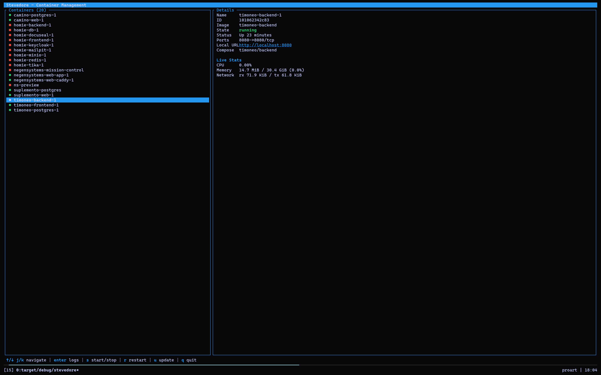

```text
 ███████╗████████╗███████╗██╗   ██╗███████╗██████╗  ██████╗ ██████╗ ███████╗
 ██╔════╝╚══██╔══╝██╔════╝██║   ██║██╔════╝██╔══██╗██╔═══██╗██╔══██╗██╔════╝
 ███████╗   ██║   █████╗  ██║   ██║█████╗  ██║  ██║██║   ██║██████╔╝█████╗  
 ╚════██║   ██║   ██╔══╝  ╚██╗ ██╔╝██╔══╝  ██║  ██║██║   ██║██╔══██╗██╔══╝  
 ███████║   ██║   ███████╗ ╚████╔╝ ███████╗██████╔╝╚██████╔╝██║  ██║███████╗
 ╚══════╝   ╚═╝   ╚══════╝  ╚═══╝  ╚══════╝╚═════╝  ╚══════╝╚═╝  ╚═╝╚══════╝
```

# Stevedore

A fast, terminal driven UI for managing Docker containers and Docker Compose stacks.

## Looks



## Features

- Live container list with running/exited indicators, refreshed every 2 seconds
- Details pane with image, state, status, ports, Compose project/service, and live CPU, memory, and network stats
- Live log streaming with scrollback
- Start, stop, and restart containers without leaving the keyboard
- One-key Compose service update: pulls the latest image and recreates the service (`docker compose pull` + `up -d --build --no-deps`), streaming the command output into the UI

## Requirements

- Rust toolchain (edition 2021)
- A running Docker daemon reachable via the default local socket
- The `docker` CLI with the Compose plugin (needed only for the update feature)

## Build and run

```sh
cargo run
```

For a release build:

```sh
cargo build --release
./target/release/stevedore
```

## Keybindings

| Key | Action |
| --- | --- |
| Up/Down or k/j | Navigate the container list |
| Enter | Toggle between details and live logs |
| s | Start or stop the selected container |
| r | Restart the selected container |
| u | Update the selected Compose service |
| PgUp / PgDn | Scroll back through logs or update output |
| Home / End | Jump to the top / return to follow mode |
| Esc | Return to the details view |
| q or Ctrl+C | Quit |

The footer always shows the bindings that apply to the current view.

## Architecture

MVU with side effects isolated in a background actor:

- `src/app.rs`: the model (`App`) and update function; all state transitions happen here
- `src/ui.rs`: pure rendering of the model with ratatui
- `src/docker.rs`: a background actor owning the bollard client; polls container state, streams logs, runs actions and Compose updates, and reports back as messages
- `src/main.rs`: terminal setup and a `tokio::select!` event loop multiplexing input events and actor messages

The UI thread never blocks on the Docker API: every action runs on its own task and results arrive as messages.

## Roadmap

- Update all services of a Compose stack at once
- Container filtering and search
- Grouping the container list by Compose project
